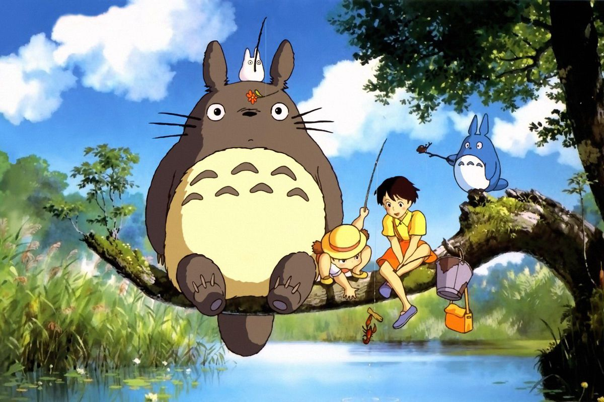

<h1 align="center">Ghibli Wiki</h1>



## Índice

- [1. Descrição do projeto](#1-descricao-do-projeto)
- [2. Funcionalidades](#2-funcionalidades)
- [3. Acesso ao Projeto](#3-acesso-ao-projeto)
- [4. Tecnologias Utilizadas](#4-tecnologias-utilizadas)
- [6. Autoria](#6-autoria)

---

## 1. Descrição do projeto

Este projeto teve como objetivo visualizar, filtrar, ordenar e trazer estatistica referentes ao Studio Ghibli, um estúdio de animação japonesa, considerando o que os fãs destes filmes gostariam de ver em uma wiki.

<video src="src/assets/Films%20_%20Studio%20Ghibli%20-%20Opera%202023-08-18%2012-40-15.mp4" controls title="demo"></video>

## 2. :hammer: Funcionalidades

- `Visualização de dados`: Conheça todos os filmes, personagens, localizações e veículos das produções do Studio Ghibli.
- `Filtragem de dados`: Filtre pelos dados e descubra quais filmes foram dirigidos pelo incrível Hayao Miyazaki.
- `Ordenação dos dados`: Ordene os dados e escolha os filmes com melhor score de audiência para assistir.
- `Pesquisa`: Encontre seu personagem favorito rapidamente para descobrir quantos anos ele tem.

## 3. Acesso ao projeto

Após baixar o projeto, instale as depêndencias necessárias:

```
npm i
```

Para abrir o projeto, execute:

```
npm start
```

### Tecnologias Utilizadas

- **HTML**

- **CSS**

- **Javascript**

- **DOM**

- **Linter**

- **Testes Unitários**

### Histórias de usuário

- Quem são os usuários principais do produto?
    - Fãs do Studio Ghibli

- Quais são os objetivos dos usuários com relação ao produto?
    - Fãs querem um local centralizado para buscar dados referentes ao Studio Ghibli

## 3. Autoria

* Gabriela Faria [@gabrielafaria608](https://github.com/gabrielafaria608)
